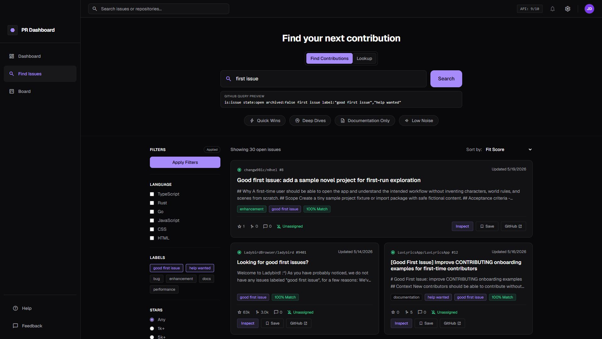

<div align="center">

# PR Dashboard

Find GitHub issues worth contributing to, not just random noise.

[](LICENSE)
[](https://vitejs.dev/)
[](docs/SECURITY.md)
[](docs/SECURITY.md)

[Live app](https://pr-dashboard-xi.vercel.app/) | [Security](docs/SECURITY.md) | [License](LICENSE)

</div>



## What It Does

PR Dashboard is a local-first GitHub issue finder for people who want to make better contribution decisions. It keeps the familiar search flow, then adds deterministic scoring, contribution guidance, and a lightweight board so promising issues do not get lost.

The app runs entirely in the browser. There is no backend, no AI API dependency, and no app-owned server receiving your token or board data.

## Product Proof Point

In May 2026, PR Dashboard helped me discover and complete a [merged contribution to TEAMMATES](https://github.com/TEAMMATES/teammates/pull/13998), a free open-source education platform for peer feedback.

PR Dashboard surfaced [issue #13997](https://github.com/TEAMMATES/teammates/issues/13997), helped me evaluate whether it was a good fit, and supported the workflow from issue discovery through local verification, CI, review feedback, and merge.

That is the workflow PR Dashboard is designed to make easier:

**discovery → confidence → action → contribution**

This is not an endorsement, partnership, or affiliation with TEAMMATES. It is a real example of PR Dashboard helping turn zero prior context into a useful open-source contribution.

## Highlights

- **Find Contributions** searches GitHub issues with contribution-focused filters.
- **Lookup** supports exact issue URLs and `owner/repo#123` references without breaking normal search.
- **Match/Fit Score** ranks issues with transparent scoring rows and pass reasons.
- **Contribution Brief** explains who an issue is best for, why it may be worth trying, and what to do first.
- **Hidden Results** lets you hide noisy issues or repos locally, then review or unhide them in Settings.
- **Board flow** saves candidates into a local contribution board for follow-up.
- **Optional GitHub PAT** increases rate limits while staying browser-local unless you choose remember mode.

## Quick Start

```bash
npm install
npm run dev
```

Then open the local URL printed by Vite.

Useful commands:

```bash
npm test
npm run build
```

## How It Handles Data

PR Dashboard talks directly to the GitHub REST API from your browser.

- Public searches work without a token.
- Tokens are optional and only used for GitHub API requests.
- Remembering a token is opt-in and uses browser `localStorage`.
- Saved board cards stay local to your browser.
- Hidden results are stored as compact issue/repo keys and timestamps only.
- No issue titles, bodies, labels, repo metadata, or tokens are stored in the hidden-results list.

Read the full security notes in [docs/SECURITY.md](docs/SECURITY.md).

## Project Structure

```text
src/
  api/                 GitHub API and repo metadata helpers
  state/               Local app store
  contributionBrief.js Rules-based contribution guidance
  hiddenItems.js       Local hidden issue/repo storage
  lookup.js            Exact Lookup parsing
  main.js              SPA rendering and UI bindings
  matchScore.js        Match/Fit Score logic
test/                  Node test suite
docs/SECURITY.md       Security and token handling notes
```

## License

PR Dashboard is open source under the [MIT License](LICENSE).

MIT allows use, copying, modification, distribution, and commercial use, but the copyright and license notice must stay with copies or substantial portions of the software.

This project is not affiliated with GitHub.
