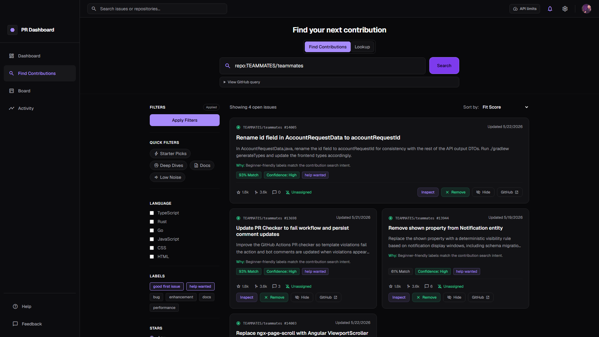
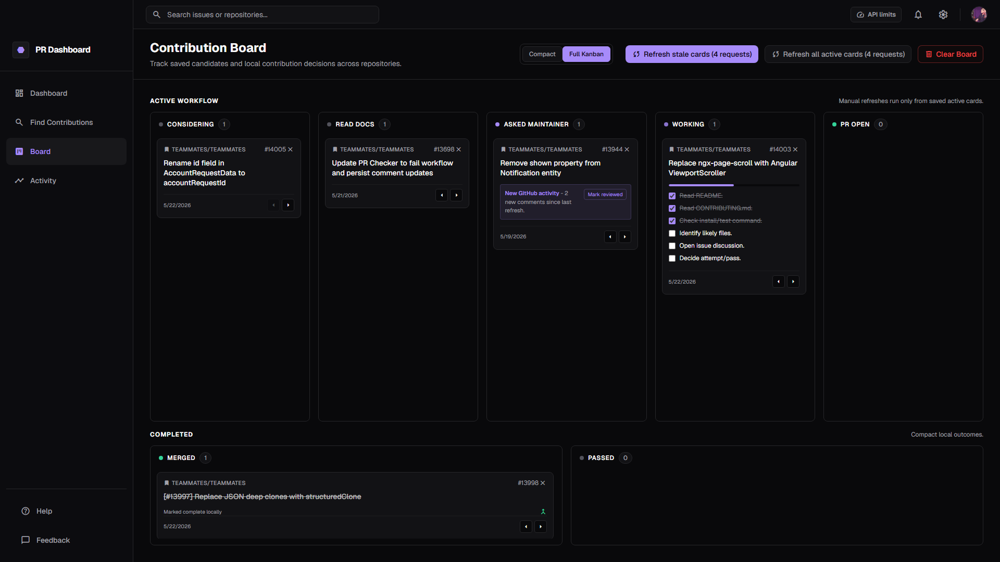
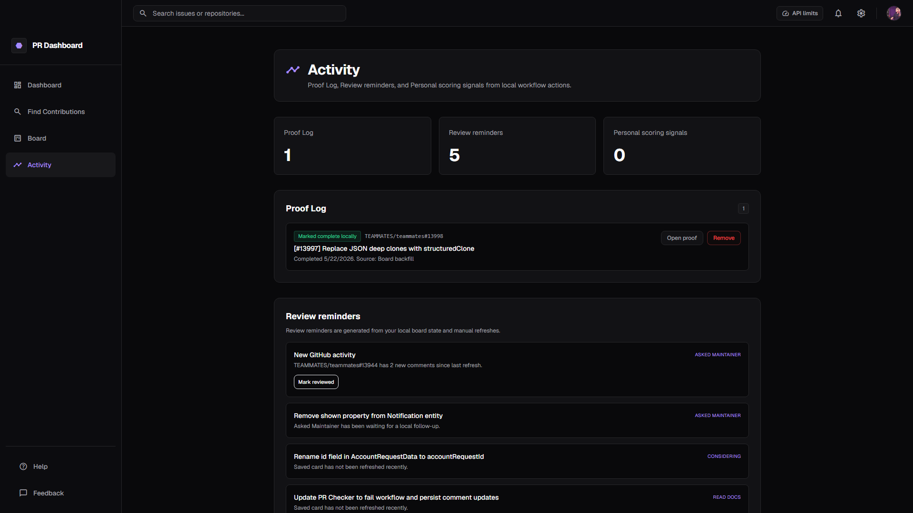
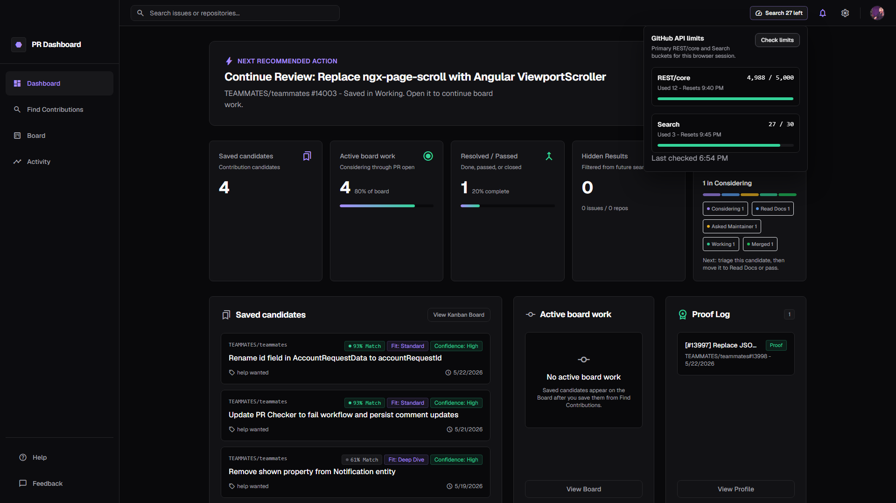

<div align="center">

# PR Dashboard

Find GitHub issues worth contributing to, not just random noise.

[](LICENSE)
[](https://vitejs.dev/)
[](https://tailwindcss.com/)
[](https://pr-dashboard-xi.vercel.app/)
[](docs/SECURITY.md)
[](docs/SECURITY.md)

[Live app](https://pr-dashboard-xi.vercel.app/) | [Security](docs/SECURITY.md) | [License](LICENSE)

</div>



## What It Does

PR Dashboard is a local-first GitHub issue finder for people who want to make better contribution decisions. It keeps the familiar search flow, then adds deterministic scoring, contribution guidance, and a lightweight Board so promising candidates do not get lost.

The app runs entirely in the browser. There is no backend sync in v1, no model API dependency, and no app-owned server receiving your GitHub token or Board data. Export/Import Local Data is the current phone/desktop bridge.

## Product Proof Point

In May 2026, PR Dashboard helped me discover and complete [TEAMMATES/teammates#13998](https://github.com/TEAMMATES/teammates/pull/13998), a merged contribution to TEAMMATES, a free open-source education platform for peer feedback.

PR Dashboard surfaced [TEAMMATES/teammates#13997](https://github.com/TEAMMATES/teammates/issues/13997), helped me evaluate whether it was a good fit, and supported the workflow from issue discovery through local verification, CI, review feedback, and merge.

That is the workflow PR Dashboard is designed to make easier:

**discovery -> confidence -> action -> contribution proof/history**

This is not an endorsement, partnership, or affiliation with TEAMMATES. It is a real example of PR Dashboard helping turn zero prior context into a useful open-source contribution.

## Product Tour

| Find Contributions | Board workflow |
| --- | --- |
|  |  |
| Score and compare real public issues with transparent fit signals before saving one to the Board. | Move candidates through local review lanes, track checklist progress, and keep completed work separate. |

| Activity proof and reminders | API limits |
| --- | --- |
|  |  |
| Keep local completion history, review reminders, and learned feedback without a backend account or remote sync. | See primary REST/core and Search rate-limit buckets from response headers or a manual check. |

## Highlights

- **Find Contributions** searches GitHub issues with contribution-focused filters.
- **Lookup** supports exact issue URLs and `owner/repo#123` references without breaking normal search.
- **Target platform filters** help triage iOS, Android, macOS, Linux, Windows, and Web fit with compact platform evidence badges.
- **Match/Fit Score** ranks issues with transparent scoring rows, setup compatibility evidence, and pass reasons.
- **Contribution Brief** explains who an issue is best for, why it may be worth trying, and what to do first.
- **Hidden Results** lets you hide noisy issues or repos locally, then review or unhide them in Settings.
- **Setup evidence** reads public repo setup docs through read-only GitHub requests, normalizes compact setup/platform signals, and uses bounded background scans to improve first-pass platform triage.
- **Inspector flow** leads from Action Center and alerts into Advanced Context, Contribution Brief, issue details, score evidence, and Action Plan, with resizable desktop width.
- **Board flow** saves candidates into a local Board for follow-up, supports Compact and Full Kanban modes, and keeps Save/Remove/Passed actions reversible.
- **Activity** owns Proof Log, Review reminders, and learned feedback/history from local workflow actions.
- **Profile** stays focused on identity, local stats, and contribution preferences.
- **Help and Feedback** provide compact local-first operating notes and feedback copy.
- **Mobile and accessibility polish** includes named icon-only controls, decorative icons hidden from assistive tech, mobile API limits, touch targets, tooltip hardening, and responsive Board/filter behavior.
- **Export/Import Local Data** moves board, hidden, profile, preferences, learned feedback, and Proof Log data between browsers without exporting tokens.
- **API limits** shows primary REST/core and Search buckets so Lookup, refresh, and Find Contributions limits are easier to reason about.
- **Optional GitHub token** increases rate limits while staying browser-local unless you choose remember mode.

## v1 Local-First Scope

v1 deliberately ships without GitHub OAuth, GitHub App auth, backend sync, encrypted sync, or a database. Profile/header avatars can render from safe GitHub avatar URLs returned by the existing Settings connection test; GitHub auth and encrypted sync are future backend-sync work.

## Quick Start

```bash
npm install
npm run dev
```

Then open the local URL printed by Vite.

Useful commands:

```bash
npm test
npm run build
npm run test:layout
npm run test:readme-screenshots
```

## How It Handles Data

PR Dashboard talks directly to the GitHub REST API from your browser.

- Public searches work without a token.
- Tokens are optional and only used for GitHub API requests.
- Find Contributions uses GitHub Search API limits. Exact Lookup and saved-card refresh use normal REST/core issue endpoints; see [GitHub REST API rate limits](https://docs.github.com/en/rest/using-the-rest-api/rate-limits-for-the-rest-api?apiVersion=2026-03-10) and [GitHub Search API limits](https://docs.github.com/en/rest/search/search?apiVersion=2026-03-10).
- API limits are tracked from response headers when possible. The manual `Check limits` action calls GitHub's rate-limit endpoint and shows the primary `core` and `search` buckets.
- Remembering a token is opt-in and uses browser `localStorage`.
- Saved board cards stay local to your browser.
- Proof Log entries, Activity history, learned feedback, profile metadata, contribution preferences, Hidden Results keys, and board-derived reminder data stay local to your browser.
- GitHub avatar images load directly from safe GitHub avatar URLs. Tokens are never placed in avatar URLs or sent with image requests.
- Export/Import Local Data is the current cross-device bridge.
- GitHub tokens are never exported, and repo metadata plus enrichment/setup caches are excluded from exports.
- Setup evidence caches normalized summaries only, not raw setup text, tokens, Authorization headers, or private data.
- Hidden results are stored as compact issue/repo keys and timestamps only.
- No issue titles, bodies, labels, repo metadata, or tokens are stored in the hidden-results list.
- Proof Log is local marked-complete history. It does not verify remote merges.

Read the full security notes in [docs/SECURITY.md](docs/SECURITY.md).

## Project Structure

```text
src/
  api/                 GitHub API and repo metadata helpers
  state/               Local app store
  boardConstants.js    Board lane and refresh constants
  boardModel.js        Board storage, migration, and movement helpers
  boardRefresh.js      Saved-card refresh orchestration
  contributionBrief.js Rules-based contribution guidance
  dashboardHero.js     Dashboard next-action recommendation logic
  dashboardMetrics.js  Local dashboard metric summaries
  dashboardReviewFlow.js Local review-flow summaries
  githubActivity.js    Saved-card activity comparison helpers
  hiddenItems.js       Local hidden issue/repo storage
  issueKeys.js         Canonical issue and pull request keys
  proofLog.js          Local completed-contribution history
  profile.js           Local non-secret profile metadata
  contributionPreferences.js Local contribution preference storage
  matchFeedback.js     Local learned feedback signals
  platformFilters.js   Target platform filter and evidence helpers
  platformSetupScan.js Bounded background setup scan helpers
  localData.js         Local export/import helpers
  localAlerts.js       Local workflow alert summaries
  lookup.js            Exact Lookup parsing
  main.js              SPA rendering and UI bindings
  matchScore.js        Match/Fit Score logic
  routing.js           Hash route parsing
  searchInteractions.js Filter and preset interactions
  security.js          Escaping and GitHub URL validation
  styles.css           Tailwind component layer and app CSS
test/                  Node test suite
docs/SECURITY.md       Security and token handling notes
```

## License

PR Dashboard is open source under the [MIT License](LICENSE).

MIT allows use, copying, modification, distribution, and commercial use, but the copyright and license notice must stay with copies or substantial portions of the software.

This project is not affiliated with GitHub.
